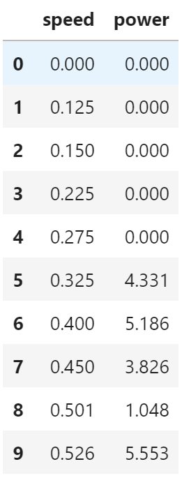
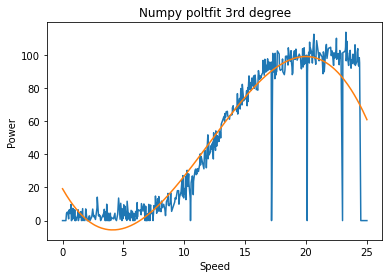

## **Yalini Brhanavan - GMIT - H.Dip Data Analytics**

* Fundamentals of Data Analysis: Project 2020
* Sep 2020

---

**How to run the file:**
*  Python version 3.8 was downloaded via Anaconda Navigator 3 to Windows 10 OS (https://www.anaconda.com/).

*  Open Anaconda naviator and launch Juyptor Lab

* Open project folder, double click on the notebook FDAProject.ipynb. 

* Select *Kernel -> Restart Kernel and Run All Cells*  from top menu

**PROJECT OUTLINE & OBJECTIVES**

In this project you must perform and explain simple linear regression using Python
on the powerproduction dataset available on Moodle. The goal is to accurately predict
wind turbine power output from wind speed values using the data set as a basis.
Your submission must be in the form of a git repository containing, at a minimum, the
following items:
1. Jupyter notebook that performs simple linear regression on the data set.
2. In that notebook, an explanation of your regression and an analysis of its accuracy.
3. Standard items in a git repository such as a README.
To enhance your submission, you might consider comparing simple linear regression to
other types of regression on this data set. Rest assured, all the above concepts will be
explored in lecture videos and other materials in the coming semester.

This project has the following sections :
- Read Data 
- Perform a linear regression using Numpy polyfit and sklearn libraries
- Explore other models using higher order polynomials

##  Read data  
Read Power production data file using Pandas  
<code>  df_power = pd.read_csv('powerproduction.txt') </code>  

This line reads the contents of the flat file into a pandas dataframe. The first few rows of the dataset is shown in the table below.  
  

The aim of this project is to develop a model that can predict power production given a wind speed. 

##  Perform a simple linear regression

This section performs a simple linear regression to analyse the relationship between Wind Speed and Power Production.  

Simple linear regressions are of the form  <code> y = m x + c </code>

I did this in 2 ways, first using Numpy polyfit function and then using scikit-learn linear regression model.  Both approaches yielded the exact same co-effiecents for the linear model. 

### Simple Linear Regression Using Numpy Plotfit
To this, first I define the speed as X variable (predictor) and power as y variable  
<code>
x = df_power[['speed']].to_numpy() 
y = df_power[['power']].to_numpy()   </code>

Then I use Numpu polyfit function which fits a first order (simple lineear) polynomial to the vectors x and y and returns the set of coefficents the minimises the squared error.  
<code> coeffs = np.polyfit(x, y, 1) </code>

This showed the coefficents of x is 4.92 and the intercept is -13.90. Thus the model implies the power generation can be expressed a linear function of speed as  
<code> power = 4.92 x speed - 13.90 </code>

The image below illustrates this linear relationship  
  

#### Simple Linear Regression Using Scikit Learn
An alternate approach would be to use the popular scikit learn machine leanring library in python. Linear Regression is part of of the family of linear models in sklearn. 

Linear model in scikit learn fits a a linear model to minimize the residual sum of squares between the observed targets (y) in the dataset, and the targets predicted by the linear approximation (x)

To this, first I imported <code> LinearRegression </code> and from sklearn.linear_model. Then I created an instance of the LinearRegression.  
<code> model = LinearRegression() </code>

Then I trained the model using x (speed) and y (power) values.  
<code> model.fit(x,y) </code> 

The model coefficent indicated coefficent of x.  
<code> model.coef_ </code> which was 4.92

The model intercept gave the constant  
<code> model.intercept_</code> which was -13.90

Therefore the linear relationship found between power and speed using sklearn was given by the formula  
<code> power = 4.92 x speed - 13.90 </code>

This was the exact same relationship found using Numpy ployfit function. This is not surprising since both functions find the coefficents of the linear model by minimising the residual sum of squares.  

The <code> model.score(x,y) </code> showed the R-square of the model is 0.73 which is reasonably high R-square value. However Linear Regression assumes a linear relationhip between the target (y) and predictor (x) variable. The chart below clearly shows this holds true only for Speed values between roughly 7 and 21.  

For example, using the formula for linear regression implies when the speed is Zero power production is -13.90. This is obviously wrong since power production is zero bound (minimum value).  
   

To illustrate the non-linear relationhip between speed and power, I plotted the actual power production against the predicted power production values. This scattor plot clearly demonstrated the model prediction is not reliable for predicted pwoer values less than 20 or predicted power values more than 90. This is because the linear relationship speed and power breaksdown when the speed is less than 7 or speed is over 21. 
 

Because the linear model is not a great fit , next I tried fitting a higher order polynomial.  

##  Higher Order Polynomial Fit    
Next I fitted a third degree polynomial with Numpy plotfit using the same methodology described above. Note I skippd second order polynmials becuase the function y = x 2  will look like a vertex, thus clearly the wrong function for this dataset.  

The coefficents of <code> coeffs = np.polyfit(x, y, 3) </code> suggested the relationship between Power and Speed is given the by equation  

<code> Power = -0.05 Speed 3  + 1.89 Speed 2  - 12.94 Speed + 19.20 </code>  

The chart below shows the third degree polynomial function and the data.  
 

The prediction of this 3rd degree ployfit produces a  slightly better fit than the (first degree) linear regression. This is clear from the scatter plot of actual vs predicted values shown in the chart below.  
 

However the 3rd degree plotfit predictions are also highly reliable for wind speed is greater than 21 as the model predicts power generation will be much lower as speed increases. 

----
**REFERENCES:**    
**1. Read Data :**
* [Pandas- read_csv documentation](https://pandas.pydata.org/pandas-docs/stable/reference/api/pandas.read_csv.html)
* [Geek for geeks - using pandas.read_csv](https://www.geeksforgeeks.org/python-read-csv-using-pandas-read_csv/)

**2. Simple Linear Regression Using Numpy Plotfit :** 
* [Pandas to_numpy() method](https://pandas.pydata.org/pandas-docs/stable/reference/api/pandas.DataFrame.values.html)
* [FDA Lectures-Topic 9 Fitting Lines](https://github.com/ianmcloughlin/jupyter-teaching-notebooks/blob/master/fitting-lines.ipynb)
* [FDA Lecture-Topic 9 Simple Linear Regression](https://github.com/ianmcloughlin/jupyter-teaching-notebooks/blob/master/simple-linear-regression.ipynb)

**3. Simple Linear Regression Using scikit learn Linear Regression :** 
* [Scikit Learn Linear Regression Documentation](https://scikit-learn.org/stable/modules/generated/sklearn.linear_model.LinearRegression.html)
* [Datacamp - Essentials of Linear Regression in Python](https://www.datacamp.com/community/tutorials/essentials-linear-regression-python)